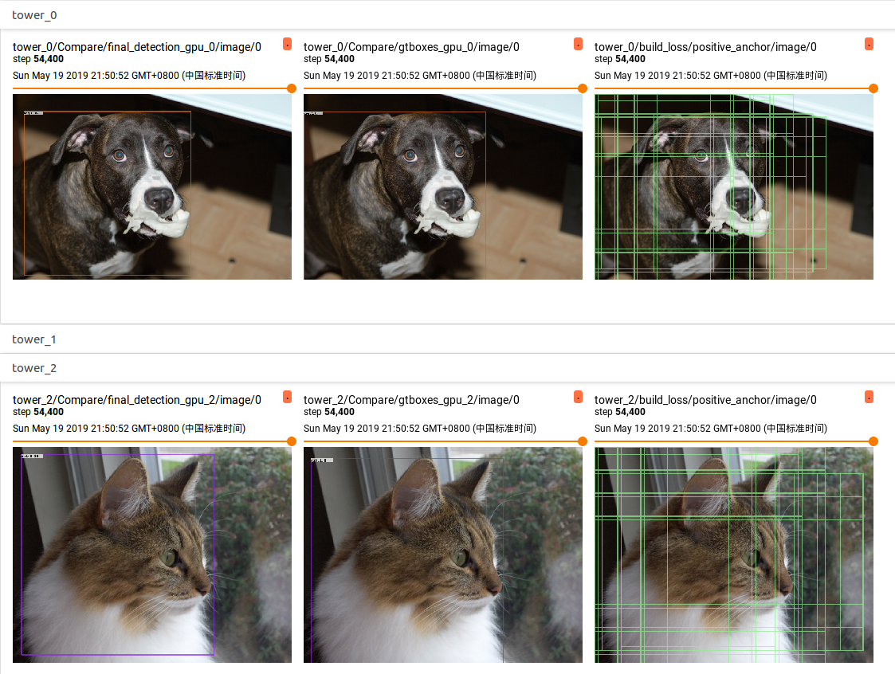
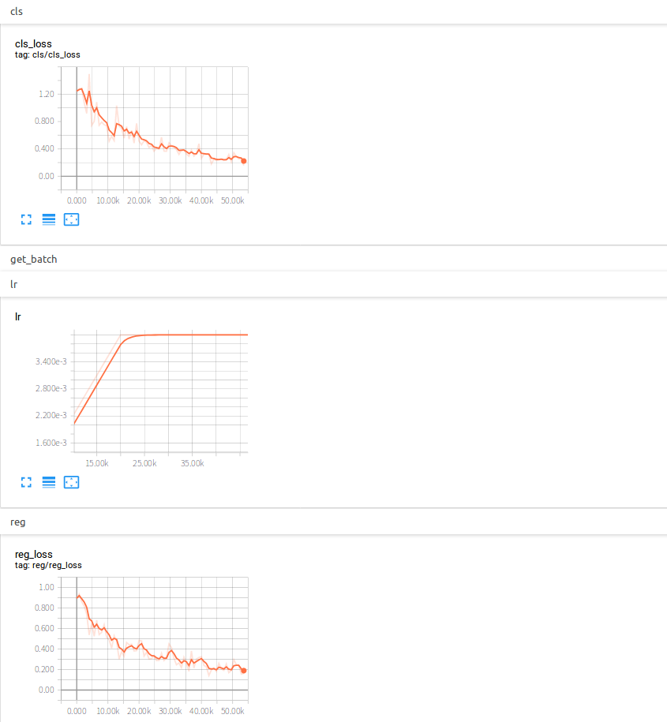

# Focal Loss for Dense Object Detection

## Abstract
This is a tensorflow re-implementation of [Focal Loss for Dense Object Detection](https://arxiv.org/pdf/1708.02002.pdf), and it is completed by [YangXue](https://github.com/yangxue0827).


### Performance
| Model |    Backbone    |    Training data    |    Val data    |    mAP    | Train Schedule | GPU | Image/GPU | Configuration File |
|:------------:|:------------:|:------------:|:---------:|:-----------:|:----------:|:----------:|:-----------:|:-----------:|
| [Faster-RCNN](https://github.com/DetectionTeamUCAS/Faster-RCNN_Tensorflow)  | ResNet50_v1 600 | VOC07 trainval | VOC07 test | 73.09 | - | 1X GTX 1080Ti | 1 | - |
| [FPN](https://github.com/DetectionTeamUCAS/FPN_Tensorflow) | ResNet50_v1 600 | VOC07 trainval | VOC07 test | 74.26 | - | 1X GTX 1080Ti | 1 | - |
| RetinaNet | ResNet50_v1 600 | VOC07 trainval | VOC07 test | 73.16 | - | 8X GeForce RTX 2080 Ti | 1 | cfgs_res50_voc07_v3.py |
| RetinaNet | ResNet50_v1d 600 | VOC07 trainval | VOC07 test | 73.26 | - | 8X GeForce RTX 2080 Ti | 1 | cfgs_res50_voc07_v4.py |
| RetinaNet | ResNet50_v1d 600 | VOC07+12 trainval | VOC07 test | 79.66 | - | 8X GeForce RTX 2080 Ti | 1 | cfgs_res50_voc0712_v1.py |
| RetinaNet | ResNet101_v1d 600 | VOC07+12 trainval | VOC07 test | 81.69 | - | 8X GeForce RTX 2080 Ti | 1 | cfgs_res50_voc0712_v4.py |
| RetinaNet | ResNet101_v1d 800 | VOC07+12 trainval | VOC07 test | 80.69 | - | 8X GeForce RTX 2080 Ti | 1 | cfgs_res50_voc0712_v3.py | 
| RetinaNet | ResNet50_v1 600 | COCO train2017 | COCO val2017 (coco minival) | 33.4 | 1x | 8X GeForce RTX 2080 Ti | 1 | cfgs_res50_coco_1x_v4.py |

## My Development Environment
1、python3.5 (anaconda recommend)             
2、cuda9.0                     
3、[opencv(cv2)](https://pypi.org/project/opencv-python/)    
4、[tfplot](https://github.com/wookayin/tensorflow-plot) (optional)            
5、tensorflow >= 1.12                   

## Download Model
### Pretrain weights
1、Please download [resnet50_v1](http://download.tensorflow.org/models/resnet_v1_50_2016_08_28.tar.gz), [resnet101_v1](http://download.tensorflow.org/models/resnet_v1_101_2016_08_28.tar.gz) pre-trained models on Imagenet, put it to data/pretrained_weights.       
2、Or you can choose to use a better backbone, refer to [gluon2TF](https://github.com/yangJirui/gluon2TF). [Pretrain Model Link](https://pan.baidu.com/s/1GpqKg0dOaaWmwshvv1qWGg), password: 5ht9.

### Trained weights
**Select a configuration file in the folder ($PATH_ROOT/libs/configs/) and copy its contents into cfgs.py, then download the corresponding [weights](https://github.com/DetectionTeamUCAS/Models/tree/master/RetinaNet_Tensorflow).**      

## Compile
```  
cd $PATH_ROOT/libs/box_utils/cython_utils
python setup.py build_ext --inplace
```

## Train

1、If you want to train your own data, please note:  
```     
(1) Modify parameters (such as CLASS_NUM, DATASET_NAME, VERSION, etc.) in $PATH_ROOT/libs/configs/cfgs.py
(2) Add category information in $PATH_ROOT/libs/label_name_dict/lable_dict.py     
(3) Add data_name to line 76 of $PATH_ROOT/data/io/read_tfrecord.py 
```     

2、make tfrecord
```  
cd $PATH_ROOT/data/io/  
python convert_data_to_tfrecord_coco.py --VOC_dir='/PATH/TO/JSON/FILE/' 
                                        --save_name='train' 
                                        --dataset='coco'
```      

3、multi-gpu train
```  
cd $PATH_ROOT/tools
python multi_gpu_train.py
```

## Eval
```  
cd $PATH_ROOT/tools
python eval_coco.py --eval_data='/PATH/TO/IMAGES/'  
                    --eval_gt='/PATH/TO/TEST/ANNOTATION/'
                    --GPU='0'
                    
``` 

```  
cd $PATH_ROOT/tools
python eval_coco_multiprocessing.py --eval_data='/PATH/TO/IMAGES/'  
                                    --eval_gt='/PATH/TO/TEST/ANNOTATION/'
                                    --gpu_ids='0,1,2,3,4,5,6,7'           
``` 

## Tensorboard
```  
cd $PATH_ROOT/output/summary
tensorboard --logdir=.
``` 





## Reference
1、https://github.com/endernewton/tf-faster-rcnn   
2、https://github.com/zengarden/light_head_rcnn   
3、https://github.com/tensorflow/models/tree/master/research/object_detection    
4、https://github.com/fizyr/keras-retinanet
